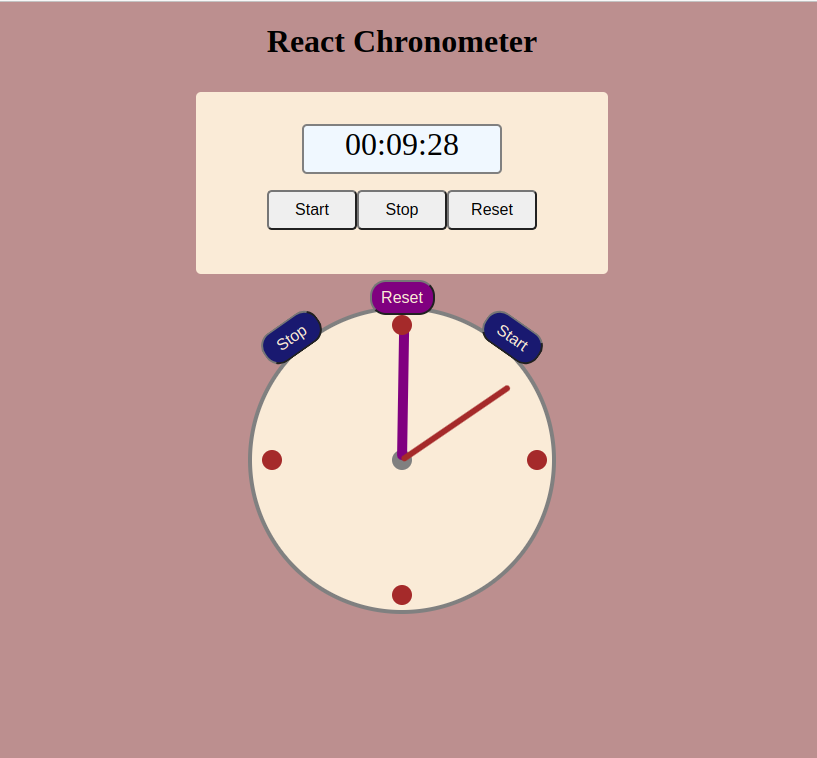

# Project name: Chromometer

**[Demo link](https://oxanadanilova.github.io/timer-react-project/)**

---

## Description

This project was created based on [Create React App](https://github.com/facebook/create-react-app).

In this web application you can run, stop and reset chronometer by clicking on the corresponding buttons "Start", "Stop" or "Reset". Time is represented as a field with values, as well as a clock face with arrows.

## How to install this Project

### 1. Install all neccessary npm packages:

`npm run install`

### 2. Run script:

`npm run start`

## Technologies

HTML5, SCSS, JavaScript, React, NPM

---

### Contact

Mail: <oxanadanilova11@gmail.com> 
GitHub: [OxanaDanilova](https://github.com/OxanaDanilova) 
LinkedIn: [Oxana Danilova](https://www.linkedin.com/in/oxana-danilova-b082a0156/)

---

Made with ❤️
